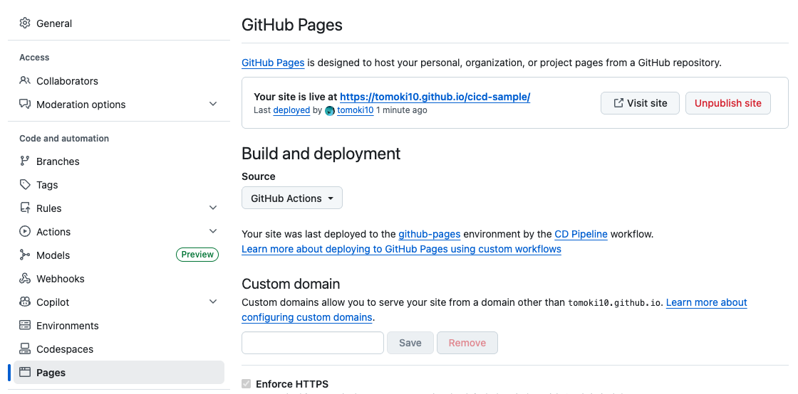

# CI/CD Sample

GitHub Actions を使った CI/CD パイプラインのサンプルリポジトリです。

## ディレクトリ構成

```
.
├── .github/workflows/
│   ├── ci.yml          # CI: テスト自動実行
│   └── cd.yml          # CD: GitHub Pages へデプロイ
├── src/
│   ├── index.html      # GitHub Pages 用ページ
│   └── index.js        # ユーティリティ関数（HTML から読み込み）
├── test/
│   └── sample.test.js  # Jest によるユニットテスト
└── package.json
```

## CI/CD パイプライン

### CI（ci.yml）

`main` ブランチへの push / Pull Request をトリガーに、以下を実行します。

1. リポジトリのチェックアウト
2. Node.js セットアップ
3. `npm install` で依存関係インストール
4. `npm test` でテスト実行

### CD（cd.yml）

CI が成功した後、`src/` ディレクトリを GitHub Pages にデプロイします。

- `workflow_run` により CI 成功時のみ実行
- `actions/deploy-pages` を使用した GitHub Pages デプロイ

## ローカルでの開発

```bash
# 依存関係のインストール
npm install

# テストの実行
npm test
```

## GitHub Pages の設定

リポジトリの Settings > Pages で、Source を **GitHub Actions** に設定してください。


